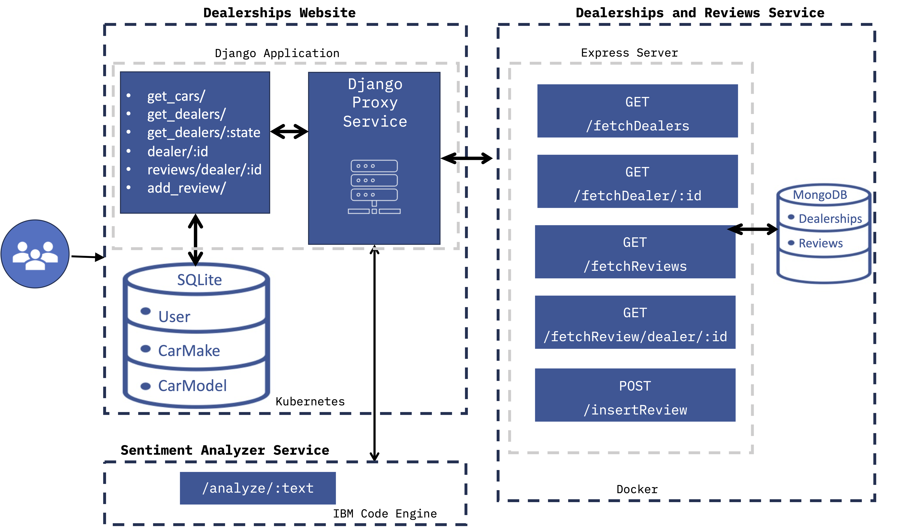

# Car Dealership Application
A website allows new and existing customers to look up different branches by state and look at customer reviews of the various branches. Customers should be able to create an account and add their review for any of the branches.

# Table of Contents
- [Use cases for anonymouse users](#use-cases-for-anonymous-users)
- [Use cases for authorized users](#use-cases-for-authorized-users)
- [Use cases for admin users](#use-cases-for-admin-users)
- [Architecture](#architecture)
  -  [Project breakdown](#project-breakdown)
  -  [Solution architecture](#solution-architecture)
- [Showcase](#showcase) 

## Use cases for anonymous users
1. View the **Contact Us** page.
2. View the **About Us** page.
3. View the list of dealerships.
4. Filter the list of dealerships by state:
   - Select **Show all** or a specific state from the State dropdown on the dealership page.
   - View all states if nothing is selected in dropdown.
   - View a table of dealerships for the selected state when the form is submitted.
5. Click on dealership to view the reviews for the dealership on the details page with each review displayed on a bootstrap card.
6. Log in using their credentials.

## Use cases for authorized users
Authorized users should be able to write a review for any dealership on their page. In order to enable authorized users to write their reviews:
1. A review button should be provided on each dealer list and its page.
2. Clicking on the **Review** button should take the user to review page.
3. Filing the form on the review page and submitting it should add the review.

## Use cases for admin users
1. Log in to the admin site with a predefined username and password.
2. Add a new make, model, and other attributes.

## Architecture
### Project breakdown
#### User management
Implement user management using [Django](https://www.djangoproject.com/) user authentication system and create a [React](https://react.dev/) front-end.
#### Back-end services
1. Create [Node.js](https://nodejs.org/en) server to manage dealers and reviews using [MongoDB](https://mongoosejs.com/) and dockerize it.
2. Deploy [sentiment analyzer](https://www.ibm.com/topics/sentiment-analysis) on [IBM Cloud Code Engine](https://www.ibm.com/products/code-engine?utm_content=SRCWW&p1=Search&p4=43700074425904135&p5=e&p9=58700008194111719&gclid=CjwKCAjwjqWzBhAqEiwAQmtgT41vI8fbUZXsuXeY1vjO2zONQBZkl6Y2JoAN86sF8sIZ7SnwgpAjAxoCSeAQAvD_BwE&gclsrc=aw.ds).
3. Create Django models and views to manage car model and car make.
4. Create Django proxy services and views to integrate dealers and reviews together.
#### Dynamic pages with Django templates
1. Create a page that displays all the dealers.
2. Create a page that displays reviews for a selected dealer.
3. Create a page that lets the end user add a review for a selected dealer.
#### CI/CD and test run
1. Set up CI/CD for code linting.
2. Run application on Cloud IDE.
3. Test the updated application locally.
4. Deploy the application on [Kubernetes](https://kubernetes.io/).

### Solution architecture
The solution will consists of multiple technologies:
1. The user interacts with the "Dealership Website," a Django website, through a web browser.
2. The Django application provides the following microservices for end users.
  - **/get_cars/** - get the list of cars.
  - **/get_dealers/** - get the list of dealers.
  - **/get_dealers/:state** - get the list of dealer by state.
  - **/dealer/:id** - get dealer by id.
  - **/review/dealer/:id** - get review specific to a dealer.
  - **/add_review/** - post a review about a dealer.
3. The Django application uses [SQLite](https://sqlite.org/) database to store the ***Car Make*** and the ***Car Model*** data.
4. The "Dealerships and Review Service" is an Express and Mongo services running in a [Docker](https://www.docker.com/) container. It provides the following services.
  - **/fetchDealers/** - fetch the dealers.
  - **/fetchDealer/:id** - fetch the dealer by id.
  - **/fetchReviews/** - fetch all reviews.
  - **/fetchReview/dealer/:id** - fetch review for a dealer by id.
  - **/insertReview/** - post a review.
5. "Dealerships Website" interacts with the "Dealerships and Reviews Service" through the "Django Proxy Service" contained within the Django Application.
6. The "Sentiment Analyzer Service" is deployed on IBM Cloud Code Engine, it provides the following service:
  - **/analyze/:text** - analyze the sentiment of the text input and return *postive*, *negative*, or *neutral*.
7. The "Dealerships Website" consumes the "Sentiment Analyzer Service" to analyze the sentiments of the reviews through the Django Proxy contained within the Django application.

## Showcase
### Deployed landing page

### Deployed logged in page

### Get dealers as anonymous user

### Get dealers as authorized user

### Dealers by state 

### Deployed dealer detail page 

### Dealership review submission

### Added review 

